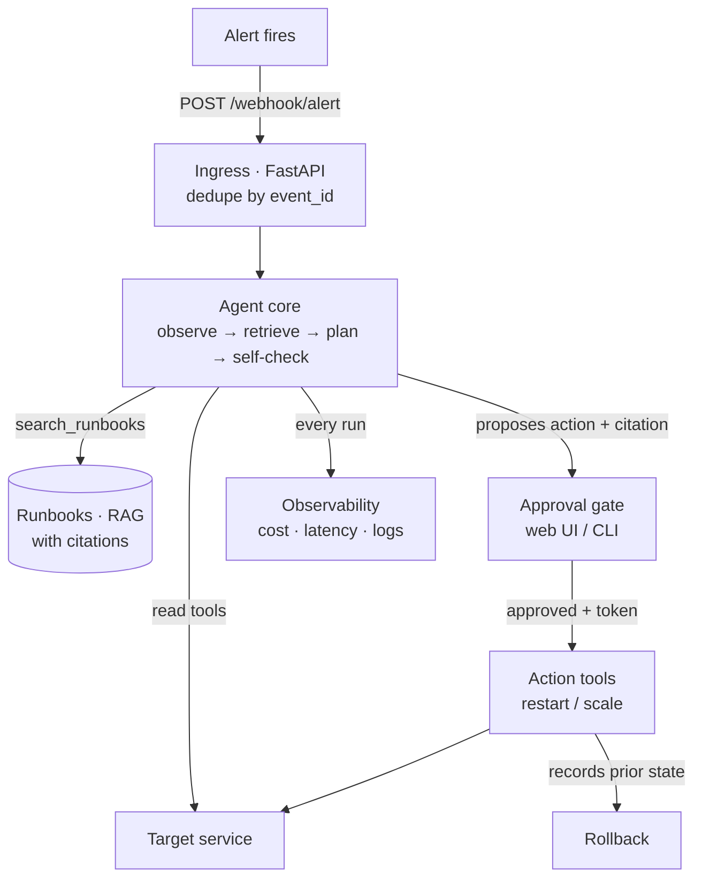

# Aegis — Agentic DevOps Assistant

An **MCP-native AI agent** that triages infrastructure alerts, proposes a remediation
**grounded in your runbooks** (with citations), and executes it **only after a human
approves** — with full tracing, cost tracking, and one-click rollback.


> Runs end-to-end **with or without** an API key. No key → a deterministic mock
> planner drives the flow so you can see everything working. Add your Anthropic
> key → Claude does the real planning.

## The problem

On-call engineers burn time on repetitive first-response triage. Fully autonomous
auto-remediation is too risky to trust with production. **Aegis does the triage and
proposes the fix, but keeps a human in control of anything that changes state.**

## Architecture



## What it demonstrates

- **Event-driven ingress** — webhook with idempotency (same `event_id` never acts twice).
- **RAG with citations** — every proposed action must cite the runbook it follows; an
  uncited action is automatically rejected and escalated to a human.
- **Human-in-the-loop** — nothing executes without a single-use approval token; full
  audit trail of who approved what.
- **Production observability** — per-decision cost, latency, and token counts; structured
  JSON logs; one-click rollback to the prior state.
- **MCP-native** — the same tools are exposed via an MCP server for use in Claude Code,
  Claude Desktop, or Cursor.

## Quickstart

```bash
git clone https://github.com/Bukola-Baiyewu1/agentic-devops-assistant
cd agentic-devops-assistant
python -m venv .venv && source .venv/bin/activate
pip install -r requirements.txt
cp .env.example .env          # optional: add ANTHROPIC_API_KEY for real planning

uvicorn src.app:app --reload  # in one terminal
./scripts/send_test_alert.sh  # in another
```

Then open the approval page printed by the script, click **Approve**, and watch the
demo service recover. Check `GET /traces` for the cost/latency of the decision.

Or run it all in a container:

```bash
docker compose up
```

## Try the whole flow by hand

```bash
curl -X POST localhost:8000/demo/break                    # make the service unhealthy
curl -X POST localhost:8000/webhook/alert -H 'Content-Type: application/json' \
  -d '{"event_id":"e1","name":"High 5xx error rate","description":"500s after deploy","service":"web"}'
# -> returns a plan citing high-error-rate.md, status pending_approval, and an approve_url

python -m scripts.cli list                                 # see pending actions
python -m scripts.cli approve <action_id>                  # execute the fix
curl localhost:8000/demo/health                            # healthy again
python -m scripts.cli rollback <action_id>                 # undo it
```

## Use the tools from Claude Code / Claude Desktop (MCP)

```bash
python -m src.mcp_server
```

Point any MCP client at it to call `get_service_health`, `get_recent_logs`,
`search_runbooks`, and `run_diagnostic` interactively.

## Configuration

| Variable | Default | Purpose |
|---|---|---|
| `ANTHROPIC_API_KEY` | _(empty)_ | Enables real Claude planning; empty → mock mode |
| `AGENT_MODEL` | `claude-sonnet-4-5` | Any Claude model you have access to |
| `RUNBOOKS_DIR` | `runbooks` | The RAG corpus |
| `STATE_PATH` | `.aegis_state.json` | Where events/actions/traces are stored |

## Testing

```bash
pytest -q
```

## Design notes

- The **target service is simulated in-process** so the demo runs with one command.
  In a real deployment the action tools would call the Docker/Kubernetes API instead;
  only `src/tools.py` and `src/demo.py` would change.
- The **RAG retriever is a dependency-free TF-IDF** so the project runs offline. Swapping
  in real embeddings + pgvector touches only `src/rag.py`.
- The **approval token is enforced inside the action tools**, not just the API layer, so
  no code path can act without approval (defense in depth).

## Roadmap

- [ ] pgvector / Supabase retrieval backend
- [ ] Langfuse hosted tracing + Grafana dashboards
- [ ] Slack approval buttons
- [ ] Real Alertmanager webhook format

## License

MIT
