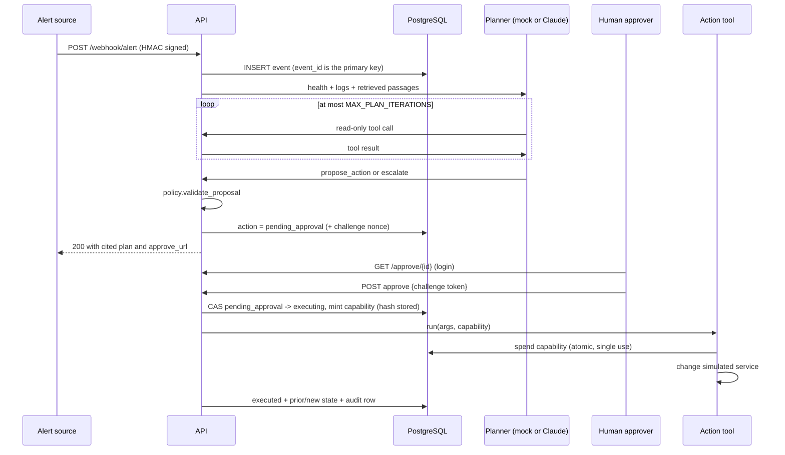
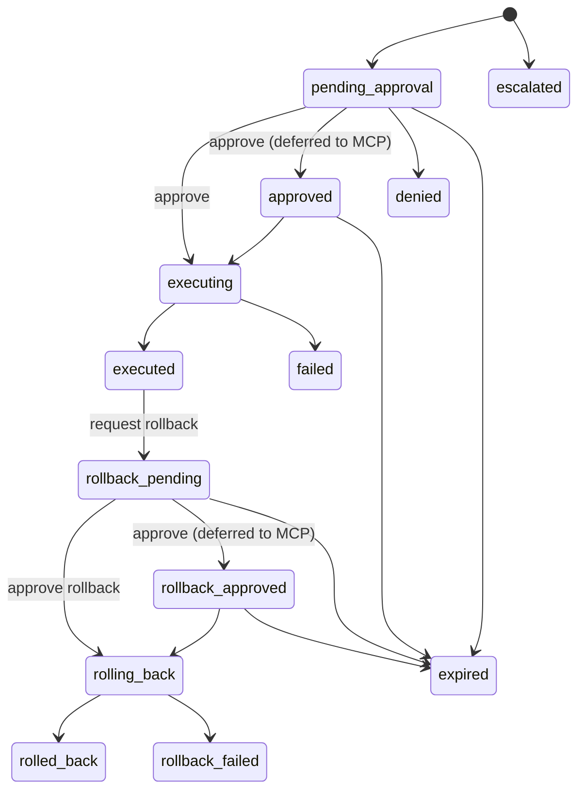

# Architecture

## Components

| Component | Process | Responsibility |
|---|---|---|
| API (`src/app.py`) | `uvicorn src.app:app` | Webhook ingress, approval UI and API, events, traces, metrics, demo controls |
| Worker (`src/worker.py`) | `python -m src.worker` | Retries due events, reclaims events whose worker died, expires approval windows |
| MCP server (`src/mcp_server.py`) | `python -m src.mcp_server` | Standard tool interface for MCP clients |
| PostgreSQL | managed or container | Events, actions, audit log, traces, capability hashes, simulator state |
| Simulator (`src/demo.py`) | state in PostgreSQL | The only "infrastructure" Aegis controls |

All three processes share one database, so the API, the worker, and an MCP client
see the same actions and the same simulated service.

## Alert lifecycle



If the planner hits a temporary error, the event is set to `retry_wait` with
exponential backoff and jitter; the worker picks it up when it is due. After
`AEGIS_MAX_EVENT_ATTEMPTS` it is `dead_lettered` and can be replayed.

## Action state machine



Every transition is checked against this table (`src/states.py`) and applied with
`UPDATE ... WHERE id = ? AND version = ?`, so concurrent requests cannot both win.
Every transition also writes an audit row with the actor and the old and new status.

## Retrieval

Runbooks are split by Markdown heading. Each chunk records `chunk_id`
(`file#heading-slug`), source, heading, 1-based start and end line, a checksum of
the passage, and a version (hash of the file). Retrieval is TF-IDF with the title
and heading indexed alongside the body, a minimum score, and top-k. The `Retriever`
protocol in `rag.py` is the seam for an embedding backend.

## Planner contract

Both planners return the same `Proposal` schema:

```json
{"decision": "propose_action", "reasoning": "...", "tool_name": "restart_service",
 "tool_args": {"service": "web"}, "citation_chunk_id": "high-error-rate#restart-after-a-recent-deploy",
 "confidence": 0.85}
```

The Claude planner uses native tool use with parallel tool calls disabled, so
each turn is at most one tool call. It uses `tool_choice: auto` because current
Claude models reason before acting and reject forced tool use (`any`/`tool`);
the system prompt requires a tool call every turn, and if the model answers in
plain text it gets one reminder, then the alert escalates. Alert text, logs, and
runbook passages are wrapped in tags that the system prompt declares to be data,
not instructions. The planner never sees approval challenges or capabilities.

## Design decisions

* **Deterministic authority.** The model proposes; code decides. Safety does not
  depend on the model following instructions.
* **Two secrets, two purposes.** The approval challenge proves a human decision
  from the approval page. The capability authorizes one exact tool call. Neither
  is stored in plain text.
* **Defense in depth.** The workflow checks status and challenge; the action tool
  checks the capability again, so no code path can act without both.
* **Durable before acknowledged.** The webhook stores the event first, so a crash
  after the response cannot lose an alert.
* **Simulator first.** Real infrastructure credentials are never needed to show
  the safety design, which keeps the public demo harmless.
